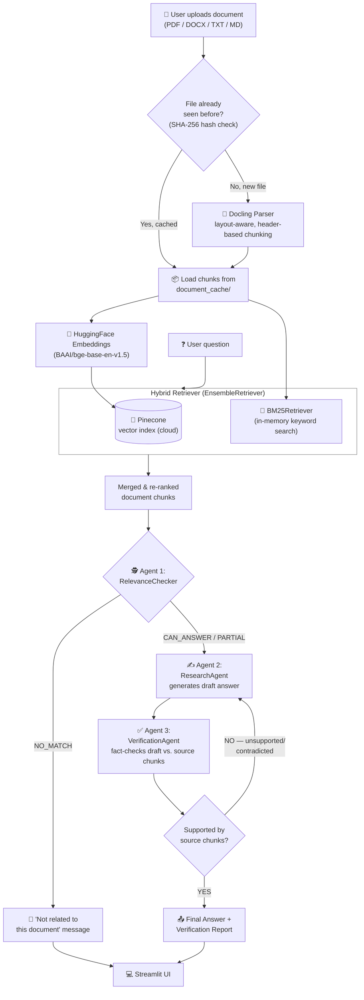

# 💻 DocChat — Agentic RAG Document Q&A

DocChat is a multi-agent Retrieval-Augmented Generation (RAG) application that lets you upload documents (PDF, DOCX, TXT, MD) and ask questions about them. Instead of a single LLM call, DocChat routes every question through a **3-agent LangGraph pipeline** — a relevance checker, a research agent, and a verification agent — combined with **hybrid retrieval** (keyword + semantic search) to reduce hallucinations and give grounded, verified answers.

---

## ✨ Features

- 🤖 **Multi-Agent System** — A Research Agent generates answers, while a Verification Agent fact-checks responses.
- 📄 **Handles Multiple Documents** – Selects the most relevant document even when multiple files are uploaded.
- 🔍 **Hybrid retrieval** — combines BM25 keyword search with vector similarity search for more robust results
- 🧠 **Scope Detection** – Prevents hallucinations by rejecting irrelevant queries.
- ♻️ **Smart caching** — re-uploading the same file (by content hash) skips reprocessing
- ☁️ **Web Interface with Streamlit** – Allowing seamless document upload and question-answering.

---

## 🧰 Tech Stack

| Layer | Technology | Notes |
|---|---|---|
| **Document parsing** | [Docling](https://github.com/docling-project/docling) | AI-powered layout-aware parsing + header-based chunking (PDF, DOCX, TXT, MD) |
| **Agent orchestration** | [LangGraph](https://github.com/langchain-ai/langgraph) | StateGraph-based multi-agent workflow with conditional routing |
| **LLM inference** | [Groq](https://groq.com/) (`langchain-groq`) | Free-tier, ultra-fast inference. Uses `openai/gpt-oss-20b` (fast agents) and `openai/gpt-oss-120b` (verification agent) |
| **Embeddings** | [Hugging Face](https://huggingface.co/) (`langchain-huggingface`, `sentence-transformers`) | Free, local/on-device embeddings — `BAAI/bge-base-en-v1.5` for higher accuracy) |
| **Vector database** | [Pinecone](https://www.pinecone.io/) (serverless, free tier) | Cloud-hosted, persistent across deploys/restarts — unlike local vector stores, survives ephemeral cloud storage |
| **Retrieval** | `BM25Retriever` | In-memory keyword search, merged with semantic search via `EnsembleRetriever` |
| **UI** | [Streamlit](https://streamlit.io/) | Simple, deployable web UI |
| **Package management** | [uv](https://github.com/astral-sh/uv) | Fast Python package/venv manager |
| **Config/env** | `python-dotenv`, `pydantic-settings` | `.env`-based configuration |
| **Logging** | `loguru` | Structured logging throughout the pipeline |

---

## 🏗️ Architecture

### End-to-end flow
 

 
> The **dashed loop** from `VerificationAgent` back to `ResearchAgent` is the self-correction step: if a draft answer isn't supported by the retrieved chunks, the workflow automatically re-runs research instead of showing an unverified answer to the user.

---

## 📂 Project Structure

```
docchat/
├── agents/
│   ├── relevance_checker.py    # Agent 1: Is the question answerable from the doc?
│   ├── research_agent.py       # Agent 2: Generate a draft answer
│   ├── verification_agent.py   # Agent 3: Fact-check the draft against sources
│   └── workflow.py             # LangGraph StateGraph wiring the 3 agents together
├── config/
│   ├── constants.py             # Allowed file types, size limits
│   └── settings.py              # Centralized config (models, API keys, retrieval params)
├── document_cache/               # Auto-generated: cached parsed document chunks
├── document_processor/
│   └── file_handler.py          # Docling-based parsing + chunking + SHA-256 file caching
├── examples/                     # Sample documents for the "Load Example" UI feature
├── retriever/
│   └── builder.py                # Builds the hybrid (BM25 + Semantic) retriever
├── utils/
│   └── logging.py                # loguru logger setup
├── app.py                        # Streamlit UI entry point
├── requirements.txt
├── .env.example                  # Template for required environment variables
└── .gitignore
```

---

## ⚙️ Setup & Installation

### Prerequisites
- Python 3.11+
- A free [Groq API key](https://console.groq.com/keys)
- A free [Pinecone API key](https://app.pinecone.io/) (Starter/free tier)

### 1. Clone the repository
```bash
git clone https://github.com/<your-username>/docchat.git
cd docchat
```

### 2. Create a virtual environment (using `uv`)
```bash
uv venv .venv
.venv\Scripts\activate      # Windows
source .venv/bin/activate   # macOS/Linux
```

### 3. Install dependencies
```bash
uv pip install -r requirements.txt
```

### 4. Configure environment variables
```bash
cp .env.example .env
```
Then fill in `.env`:
```dotenv
GROQ_API_KEY=your-groq-api-key
PINECONE_API_KEY=your-pinecone-api-key
PINECONE_INDEX_NAME=docchat-index
PINECONE_CLOUD=aws
PINECONE_REGION=us-east-1
```

> The Pinecone index is created automatically on first run — no manual dashboard setup needed.

### 5. Run the app
```bash
streamlit run app.py
```
Open the URL shown in the terminal (usually `http://localhost:8501`).

---

## 🖥️ Usage

1. Upload a document (or click **Load Example** to try a sample)
2. Type your question
3. Click **Submit**
4. Review the **Answer** and the **Verification Report** — the report tells you whether the answer is fully supported by the document, flags any unsupported claims, and notes relevance to your question

---

## 👤 Author

**Huzaifa Nawaid**
- GitHub: [@HuzaifaNawaid](https://github.com/HuzaifaNawaid)
- Gmail: [nawaidhuzaifa@gmail.com](nawaidhuzaifa@gmail.com)

---

# 🙏 Acknowledgements

- Document parsing powered by [Docling](https://github.com/docling-project/docling)
- Agent orchestration powered by [LangGraph](https://github.com/langchain-ai/langgraph)
- LLM inference powered by [Groq](https://groq.com/) 
- Embeddings powered by [Hugging Face](https://huggingface.co/) 
- Vector database powered by [Pinecone](https://www.pinecone.io/)
- UI powered by [Streamlit](https://streamlit.io/)
- Package management powered by [uv](https://github.com/astral-sh/uv)

---

Built with multi-agent intelligence 🤖 by Huzaifa Nawaid ❤️
